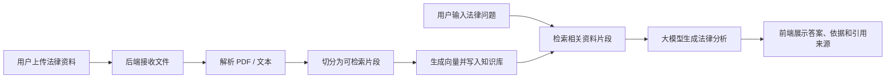
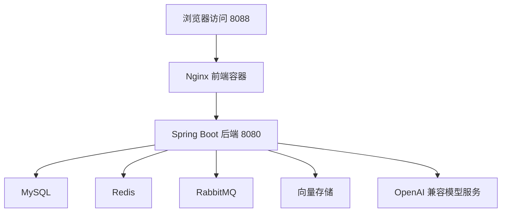

# LexScope Agent 架构说明

## 2026-07-01 上传链路补充

为了让普通用户打开 8088 后可以直接上传 PDF，前端 Nginx 为 `/api/ai/pdf/upload/` 增加了独立代理入口。这个入口会清空浏览器可能残留的旧 Authorization，并统一补充本地演示上传密钥和 `public` 使用范围，然后再转发到后端已有上传接口。这样没有修改后端接口、数据库结构或入库逻辑，只是在部署层把“默认可上传”的演示体验兜住。

补充排查发现，浏览器上传 multipart 文件时会自动带 `Origin: http://127.0.0.1:8088`，后端服务看到该头后会进入 CORS 判断并返回 `Invalid CORS request`。因为 8088 本身就是前端代理入口，不需要把这个 Origin 继续传给后端，所以上传专用代理同时清空 Origin，避免同源页面上传被误判为跨域请求。

同样的处理也应用到 `/api/ai/react/` 问答接口。用户在页面提问时，浏览器会带上 Origin 和可能残留的旧 Authorization，如果直接传给后端会导致流式回答被 403 拦截。前端代理层统一清理这些演示环境下不需要的请求头，并补充本地演示密钥，保证“上传资料后直接提问”的主流程稳定。

前端桌面布局采用“左侧固定、右侧消息区滚动”的结构。外层应用固定为一个视口高度，左侧栏保持自己的高度和底部设置入口，长回答只在右侧消息列表内部滚动，避免用户下拉时左侧栏内容被页面滚动带走。移动端仍然使用自然文档流，保证小屏幕可以顺畅上下浏览。

回答展示层不再在答案顶部放一排固定快捷标签。答案正文仍由模型和 Markdown 小标题承载“初步分析、风险提示、引用来源”等结构，前端只在每次回答结束后追加一段“延伸提问建议”。建议由前端根据本次回答和上一条用户问题中的关键词生成，优先覆盖合同条款、证据、诉讼、法律风险、租赁和房屋信息等常见追问方向，不影响后端问答接口。

资料上传入口同时支持点击选择和整页拖拽。拖拽 PDF 时复用已有 `/ai/pdf/upload/{chatId}` 上传链路，拖拽 TXT 时读取文本并填入输入框辅助提问，Word 文件仍提示用户先另存为 PDF 或复制正文。这个能力只是前端交互入口扩展，没有新增后端接口或数据库字段。

流式输出链路同时覆盖生产网关和本地开发代理。生产入口由前端 Nginx 对 `/api/ai/react/` 清理浏览器残留的 Authorization 和 Origin，并补充演示环境默认 API Key；本地 Vite 代理也使用同样策略，避免开发模式与 8088 演示入口表现不一致。前端 SSE 解析会识别标准 `event:` / `data:` 格式，并保留后端 `msg`、`message`、`error` 或 `detail` 中的真实失败原因，方便区分鉴权、CORS、预算保护、模型超时等问题。

PDF/RAG 问答的引用展示从调试格式收敛为正式来源卡片。后端 RAG 结果不再把 `source=...`、`chunk=...` 拼进答案正文，而是返回结构化引用：编号、文件名、页码、80 字以内摘要；`tenant_id`、`job_id`、`source_type`、`chunk_index`、`distance` 等仍可保留在 `debug` 字段中，默认前端不展示。前端统一在答案下方显示“参考来源”，不再同时展示正文引用 footer、引用 chips 和相关依据列表。

引用摘要现在会在后端和前端各清洗一次。后端使用清洗后的文档正文做重排、上下文拼接和证据摘要，避免 `Document.getFormattedContent()` 中的 metadata 进入模型上下文或用户卡片；前端继续兼容旧会话或旧接口结果，展示前会移除 `tenant_id`、`job_id`、`distance`、`source_type`、`chunk_index`、`page_number` 等字段。ReAct trace 中原来固定显示的“资料匹配 40/25/20/15”已移除，避免把静态占比误展示为真实检索过程；聊天正文和引用卡片字号略微放大，消息阅读区也适度放宽。

参考来源卡片点击不再使用 `window.open('/api/ai/pdf/file/{chatId}')` 直接打开后端文件接口。该接口和聊天、会话、成本等接口一样受统一鉴权保护，浏览器新窗口不会自动携带前端 API 客户端里的 `Authorization` 或 `X-API-Key`，所以会返回 `missing or invalid credentials`。现在前端通过受控 `fetchPdfFile` 请求携带同一套 `authContext()` 请求头，拿到 PDF blob 后在页面内弹出来源预览，同时展示引用编号、文件名、页码和片段摘要；后端文件接口的鉴权规则保持不变。

聊天消息编辑继续沿用“修改后创建新版本”的会话分支逻辑，但普通用户入口文案简化为“编辑”，避免按钮本身解释过多流程细节。编辑态输入区横向放宽并保留自适应高度，适合修改较长法律问题；Agent 处理过程默认折叠，只显示步骤数和耗时摘要，用户需要排查时再展开查看完整 trace。

会话分组仍是前端会话管理能力，不新增独立后端分组表。前端会在 localStorage 中单独保存用户创建过的 `workspaceIds`，下拉选项由默认分组、本地分组列表和现有会话的 `workspaceId` 合并生成，所以没有记录的空分组也不会因为切回默认分组而消失。置顶和归档保持“先本地生效”，云端同步改为保存完整会话快照，通过已有 upsert 接口兼容本地新建但尚未保存到云端的记录。

会话云端同步进一步改为“本地即时保存、云端静默同步”的双层策略。前端仍会把当前会话、分支、模型配置和筛选偏好写入 localStorage，保证刷新页面不丢内容；涉及会话内容或会话配置的变化会进入一个防抖自动保存队列，复用已有 `PUT /ai/sessions/{sessionId}` upsert 接口同步到云端。流式回答过程中不会持续请求云端，等回答结束后再保存最终快照；首次打开且本地没有会话缓存时，会静默读取一次云端记录，但本地已有缓存时不会自动覆盖，避免误丢未同步的本机记录。设置里的“从云端读取 / 保存至云端”保留为兜底操作。

侧栏只展示“本月用量”，不再把默认预算额度暴露给普通用户。后端成本治理、预算表和 `/cost/budget` 接口仍然保留，界面简化不代表取消预算保护。

为了方便新开 Codex 窗口继续维护，项目新增 `docs/CODEX_HANDOFF.md`。该文档记录新窗口先读内容、前端体验原则、文档同步规则和固定 Git 提交策略；后续每次项目改进都必须同步 `ARCHITECTURE.md`、`CHANGELOG.md`、`INTERVIEW_NOTES.md`，并在最终回复输出包含目标、改动文件、具体改动、实现效果、验证方式、风险与后续的变更报告。

持续更新的维护文档默认使用中文，包括 `docs/CODEX_HANDOFF.md`、`docs/index.md`、`CHANGELOG.md` 以及三份项目记录文档。命令、路径、接口名、配置键和 commit message 格式等必要技术标识可以保留英文，正文说明优先用中文，方便后续自己复盘和面试表达。

本文档用偏产品化的语言记录 LexScope Agent 的系统流程和模块作用，方便后续开发、复盘和面试说明。

## 1. 项目定位

LexScope Agent 是一个面向中文法律场景的智能问答与案例研判系统。普通用户看到的是“法律智能问答”：上传法律资料，输入问题，系统基于资料内容生成有依据的法律分析。底层仍保留 RAG、Agent、评测、多租户、鉴权、审计和可观测性等工程能力，但这些概念默认不直接暴露给普通用户。

## 2. 总体流程

## 3. 前端模块

### 法律智能问答主界面

作用：让普通中文法律用户直接知道如何使用系统。

主要内容：
- 主标题是“法律智能问答”。
- 首屏不再展示三步说明卡片，而是以“开始法律智能问答”为标题，只给用户一个核心动作：上传法律资料，或者直接在底部输入框提问。
- 上传入口采用更大的居中浅边框卡片，包含文件图标、上传按钮、格式提示和“或者直接输入问题开始”的分隔线，视觉上更像聊天产品的空状态，而不是功能说明页。
- 空状态只保留 3 个无图标快捷问题：合同风险、争议焦点、法律分析报告；问题概括、争议焦点、相关依据等结果模块等到真实回答时再出现，避免用户第一次进入时像在读说明书。
- “上传法律资料”按钮复用已有上传接口处理 PDF；TXT 内容可读取到输入框辅助提问，Word 文件会提示先另存为 PDF 或复制正文，前端不新增后端接口。
- 左侧侧栏保持轻量，顺序是记录搜索、新建问答、我的记录列表；分组筛选、归档显示、云端同步、历史版本等管理动作放到设置里。
- 记录搜索框使用更大的点击区域和统一的聚焦态，保证它看起来像主流程入口，而不是临时表单控件。
- 点击“新建问答”会创建一条名为“新对话”的记录，并按最新更新时间显示在“我的记录”顶端，使用方式更接近常见聊天产品。
- 我的记录卡片只展示会话标题和更新时间，不展示 chatId、sessionId、uuid 截断值、分组等内部字段；这些字段仍保留在前端状态和后端数据中供接口调用。
- 我的记录列表不再使用外层卡片包裹，靠单条会话卡片承载边界，减少“卡片套卡片”的视觉噪声。
- 回答区域用法律场景标题组织内容，例如争议焦点、相关依据、引用来源和风险提示。
- 聊天输入框内部放置“回答质量”和“实时输出”控制，用户可以像使用常见 AI 聊天工具一样，在提问前直接切换模式。
- “实时输出”走 `/ai/react/chat/stream` SSE 接口；后端无论是模型原生流式结果，还是已经生成好的直接答案，都会按 token 小段推送给前端，避免用户看到整段答案一次性出现。
- 输入框下方不再重复展示“生成报告、概括争议、整理依据、提示风险”等快捷按钮，避免用户在真正输入问题前被过多建议打断。
- 主内容头部只保留深浅色主题切换，分组、新建分组、归档显示等管理动作统一放入设置，避免普通用户在提问前被一排工具按钮打断。
- 消息角色显示为“我”和“法律助手”，不展示英文 Assistant，也不使用头像，减少界面里的工具感和技术感。
- “历史版本”放在设置的高级设置中，版本数量、另存、对比和采用当前版本等能力保留，但默认不占用普通用户侧栏。

### 设置与开发者工具

作用：保留高级能力，但降低普通用户干扰。

设置面板分层：
- 基础设置：默认只展示模型 API Key、保存设置、恢复默认。
- 数据管理：默认折叠，放置从云端读取、保存至云端等同步操作；“清空当前会话”不在普通设置面板展示，避免误触。
- 高级设置：默认折叠，放置使用范围、会话分组、记录筛选、归档记录显示、历史版本和效果评测。
- 左侧栏底部在“设置”按钮上方展示本月用量和预算概览，让用户能直接看到基础用量信息；详细配置仍放在设置里。
- 说明类内容不再作为设置面板底部卡片展示，避免用户打开设置时再次看到说明书式文案。

展示原则：
- 默认使用本地演示模型 API Key，普通用户打开页面后可以直接提问；模型 API Key 窗口保留在设置里，供需要替换模型服务时调整。
- 前端启动时优先使用项目内置演示密钥，不再让浏览器里残留的旧 API Key 阻塞上传；如果上传遇到鉴权配置错误，会自动恢复默认密钥并重试一次。
- 上传资料入口在前端 API 层固定使用项目内置上传密钥，避免设置面板里的模型服务 Key、旧 token 或旧应用 Key 影响入库权限；设置面板仍用于模型服务配置。
- 前端 Nginx 代理允许上传 100MB 以内文件，与后端 multipart 配置一致；上传失败时按真实原因提示文件过大、格式不正确或权限校验失败。
- 复杂功能默认折叠，按钮、输入框和下拉框使用统一宽度，避免控件超出面板。
- 已经放在主界面的能力不在开发者工具里重复出现，例如深浅色切换。

### 前端接口层

作用：封装浏览器到后端 API 的调用。

典型职责：
- 调用登录、刷新连接、智能问答、流式问答、会话保存、历史版本、效果评测等接口。
- 调用已有资料上传接口，把首屏上传按钮和后端入库能力连接起来，同时用友好文案隐藏 `/ai/pdf/upload` 这类内部接口名称。
- 统一处理请求头、服务地址和错误提示。
- Nginx 代理关闭 SSE 缓冲并保留分块传输能力，保证浏览器能及时收到后端推送的小段内容。
- 不改变后端接口定义，只调整用户可见的展示和交互。

## 4. 后端模块

### 鉴权与访问控制

作用：保护接口，支持本地演示和未来多用户扩展。

主要能力：
- API Key 换取 JWT。
- Refresh Token 刷新登录状态。
- 使用范围 / 租户隔离，避免不同用户的数据混在一起。
- 审计日志记录关键操作。

### 资料入库模块

作用：把用户上传的法律资料变成可检索知识。

主要流程：
1. 接收上传文件；
2. 解析 PDF 或文本；
3. 按段落切片；
4. 生成 embedding；
5. 写入向量存储；
6. 记录入库任务状态。

### 智能问答模块

作用：根据用户问题和资料内容生成有依据的回答。

主要流程：
1. 接收用户问题；
2. 如果是普通解释类问题，且没有要求文档、引用、法条、案例或报告，走快答路径，直接用一次模型调用生成初步解释；
3. 如果问题需要依据、材料或检索，走 ReAct 规划、资料检索和最终总结流程；
4. 返回回答、引用来源、证据片段和处理过程。

### 会话与历史版本

作用：保存用户的问答记录，并支持同一问题的不同分析版本。

普通用户在侧栏主要看到“我的记录”，历史版本放入设置中的高级设置；后端仍保存会话、版本关系、对比和采用当前版本等能力。

### 效果评测模块

作用：给开发者测试检索命中、引用覆盖和回答可靠性。

普通用户默认不需要使用。开发或演示时，可以用它说明系统不是只追求“能回答”，还在关注回答是否有依据、引用是否覆盖、结果是否稳定。

## 5. 数据与中间件

| 组件 | 作用 |
|---|---|
| MySQL | 保存用户、会话、入库任务、评测记录等结构化数据 |
| Redis | 支持缓存、队列或运行时状态 |
| RabbitMQ | 支持异步入库任务，避免上传大文件时阻塞主请求 |
| 向量存储 / pgvector | 保存资料切片的向量，用于相似内容检索 |
| Docker Compose | 一键启动前端、后端、数据库和中间件 |

## 6. 部署结构

## 7. 设计原则

- 普通用户界面不展示 JWT、Tenant、SSE、RAG、向量检索等技术词。
- 高级能力不删除，只默认折叠到设置或开发者工具。
- 前端文案优先讲“能做什么”，不要优先讲“用了什么技术”。
- 关键操作按钮统一使用产品主色，避免同一界面里出现默认组件蓝和自定义墨蓝混用。
- 后端接口和数据结构尽量稳定，产品化调整主要发生在前端展示层。
- 每次代码修改后同步维护 `CHANGELOG.md`、`ARCHITECTURE.md` 和 `INTERVIEW_NOTES.md`。
