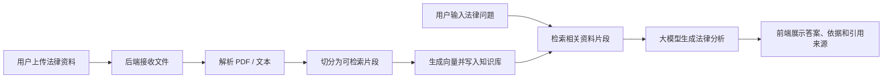
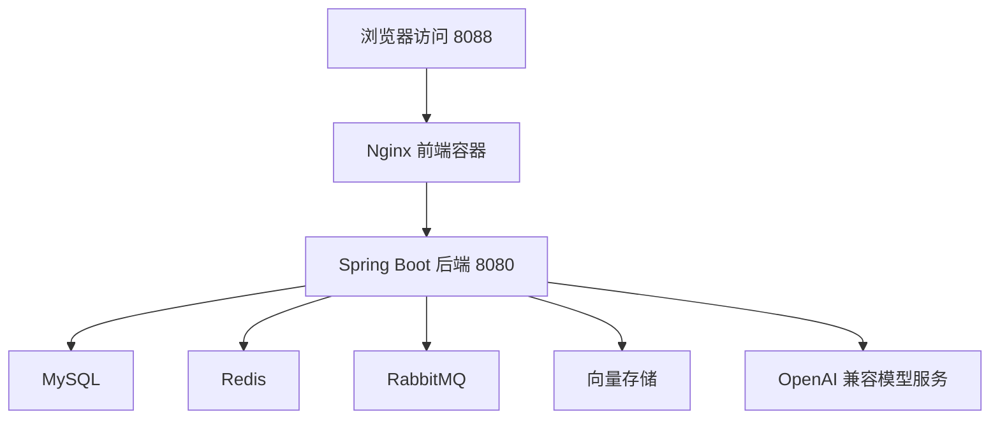

# LexScope Agent 架构说明

本文档用偏产品化的语言记录 LexScope Agent 的系统流程和模块作用，方便后续开发、复盘和面试说明。

## 1. 项目定位

LexScope Agent 是一个面向中文法律场景的智能问答与案例研判系统。普通用户看到的是“法律智能问答”：上传法律资料，输入问题，系统基于资料内容生成有依据的法律分析。底层仍保留 RAG、Agent、评测、多租户、鉴权、审计和可观测性等工程能力，但这些概念默认不直接暴露给普通用户。

## 2. 总体流程

## 3. 前端模块

### 法律智能问答主界面

作用：让普通中文法律用户直接知道如何使用系统。

主要内容：
- 主标题是“法律智能问答”。
- 首屏不再展示三步说明卡片，而是以“开始法律智能问答”为标题，只给用户一个核心动作：上传法律资料，或者直接在底部输入框提问。
- 空状态只保留 3 个快捷问题：合同风险、争议焦点、法律分析报告；问题概括、争议焦点、相关依据等结果模块等到真实回答时再出现，避免用户第一次进入时像在读说明书。
- “上传法律资料”按钮复用已有上传接口处理 PDF；TXT 内容可读取到输入框辅助提问，Word 文件会提示先另存为 PDF 或复制正文，前端不新增后端接口。
- 左侧侧栏保持轻量，顺序是记录搜索、新建问答、我的记录列表；分组筛选、归档显示、云端同步、历史版本等管理动作放到设置里。
- 记录搜索框使用更大的点击区域和统一的聚焦态，保证它看起来像主流程入口，而不是临时表单控件。
- 点击“新建问答”会创建一条名为“新对话”的记录，并按最新更新时间显示在“我的记录”顶端，使用方式更接近常见聊天产品。
- 我的记录卡片只展示会话标题和更新时间，不展示 chatId、sessionId、uuid 截断值、分组等内部字段；这些字段仍保留在前端状态和后端数据中供接口调用。
- 我的记录列表不再使用外层卡片包裹，靠单条会话卡片承载边界，减少“卡片套卡片”的视觉噪声。
- 回答区域用法律场景标题组织内容，例如争议焦点、相关依据、引用来源和风险提示。
- 聊天输入框内部放置“回答质量”和“实时输出”控制，用户可以像使用常见 AI 聊天工具一样，在提问前直接切换模式。
- “实时输出”走 `/ai/react/chat/stream` SSE 接口；后端无论是模型原生流式结果，还是已经生成好的直接答案，都会按 token 小段推送给前端，避免用户看到整段答案一次性出现。
- 输入框下方不再重复展示“生成报告、概括争议、整理依据、提示风险”等快捷按钮，避免用户在真正输入问题前被过多建议打断。
- 主内容头部只保留深浅色主题切换，分组、新建分组、归档显示等管理动作统一放入设置，避免普通用户在提问前被一排工具按钮打断。
- 消息角色显示为“我”和“法律助手”，不展示英文 Assistant，也不使用头像，减少界面里的工具感和技术感。
- “历史版本”放在设置的高级设置中，版本数量、另存、对比和采用当前版本等能力保留，但默认不占用普通用户侧栏。

### 设置与开发者工具

作用：保留高级能力，但降低普通用户干扰。

设置面板分层：
- 基础设置：默认只展示模型 API Key、保存设置、恢复默认。
- 数据管理：默认折叠，放置从云端读取、保存至云端等同步操作；“清空当前会话”不在普通设置面板展示，避免误触。
- 高级设置：默认折叠，放置使用范围、会话分组、记录筛选、归档记录显示、历史版本、效果评测和本月用量。
- 关于系统：默认展示普通用户可理解的用途说明和基本使用方式。

展示原则：
- 默认使用本地演示模型 API Key，普通用户打开页面后可以直接提问；模型 API Key 窗口保留在设置里，供需要替换模型服务时调整。
- 复杂功能默认折叠，按钮、输入框和下拉框使用统一宽度，避免控件超出面板。
- 已经放在主界面的能力不在开发者工具里重复出现，例如深浅色切换。

### 前端接口层

作用：封装浏览器到后端 API 的调用。

典型职责：
- 调用登录、刷新连接、智能问答、流式问答、会话保存、历史版本、效果评测等接口。
- 调用已有资料上传接口，把首屏上传按钮和后端入库能力连接起来，同时用友好文案隐藏 `/ai/pdf/upload` 这类内部接口名称。
- 统一处理请求头、服务地址和错误提示。
- Nginx 代理关闭 SSE 缓冲并保留分块传输能力，保证浏览器能及时收到后端推送的小段内容。
- 不改变后端接口定义，只调整用户可见的展示和交互。

## 4. 后端模块

### 鉴权与访问控制

作用：保护接口，支持本地演示和未来多用户扩展。

主要能力：
- API Key 换取 JWT。
- Refresh Token 刷新登录状态。
- 使用范围 / 租户隔离，避免不同用户的数据混在一起。
- 审计日志记录关键操作。

### 资料入库模块

作用：把用户上传的法律资料变成可检索知识。

主要流程：
1. 接收上传文件；
2. 解析 PDF 或文本；
3. 按段落切片；
4. 生成 embedding；
5. 写入向量存储；
6. 记录入库任务状态。

### 智能问答模块

作用：根据用户问题和资料内容生成有依据的回答。

主要流程：
1. 接收用户问题；
2. 如果是普通解释类问题，且没有要求文档、引用、法条、案例或报告，走快答路径，直接用一次模型调用生成初步解释；
3. 如果问题需要依据、材料或检索，走 ReAct 规划、资料检索和最终总结流程；
4. 返回回答、引用来源、证据片段和处理过程。

### 会话与历史版本

作用：保存用户的问答记录，并支持同一问题的不同分析版本。

普通用户在侧栏主要看到“我的记录”，历史版本放入设置中的高级设置；后端仍保存会话、版本关系、对比和采用当前版本等能力。

### 效果评测模块

作用：给开发者测试检索命中、引用覆盖和回答可靠性。

普通用户默认不需要使用。开发或演示时，可以用它说明系统不是只追求“能回答”，还在关注回答是否有依据、引用是否覆盖、结果是否稳定。

## 5. 数据与中间件

| 组件 | 作用 |
|---|---|
| MySQL | 保存用户、会话、入库任务、评测记录等结构化数据 |
| Redis | 支持缓存、队列或运行时状态 |
| RabbitMQ | 支持异步入库任务，避免上传大文件时阻塞主请求 |
| 向量存储 / pgvector | 保存资料切片的向量，用于相似内容检索 |
| Docker Compose | 一键启动前端、后端、数据库和中间件 |

## 6. 部署结构

## 7. 设计原则

- 普通用户界面不展示 JWT、Tenant、SSE、RAG、向量检索等技术词。
- 高级能力不删除，只默认折叠到设置或开发者工具。
- 前端文案优先讲“能做什么”，不要优先讲“用了什么技术”。
- 关键操作按钮统一使用产品主色，避免同一界面里出现默认组件蓝和自定义墨蓝混用。
- 后端接口和数据结构尽量稳定，产品化调整主要发生在前端展示层。
- 每次代码修改后同步维护 `CHANGELOG.md`、`ARCHITECTURE.md` 和 `INTERVIEW_NOTES.md`。
