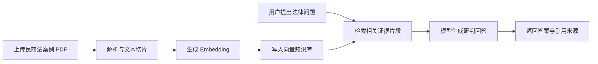

# LexScope Agent

> 民商法案例智能研判与法规检索 Agent 平台

LexScope Agent 是一个面向民商法场景的法律知识库 Agent 系统。项目基于 Spring Boot、Spring AI、Vue 3 与 Docker Compose，提供 PDF 案例入库、向量检索、证据引用、流式问答、JWT 鉴权、多租户隔离、审计日志与可观测性能力，目标是把“可追溯的法律知识问答”包装成一套可部署、可演示、可继续扩展的完整平台。

本仓库当前定位为个人作品集项目：重点展示 AI Agent 工程化、RAG 知识库、后端安全鉴权、Docker 本地部署、前后端联调和法律场景产品化包装能力。

## 项目亮点

| 能力 | 说明 |
|---|---|
| 民商法案例研判 | 支持围绕合同、租赁、担保、公司法等民商事问题进行案例型问答 |
| PDF 知识库入库 | 上传案例 PDF 后异步解析、切片、生成 embedding 并写入向量存储 |
| RAG 引用溯源 | 回答中返回来源、片段和文档依据，降低无依据生成风险 |
| Agent 工作流 | 保留 ReAct/Workflow 思路，支持模型调用轨迹与分支会话展示 |
| OpenAI 兼容模型 | 支持通过环境变量接入硅基流动、DeepSeek、Qwen Embedding 等兼容接口 |
| 安全鉴权 | 支持 API Key 换取 JWT、Refresh Token、多租户 Header 与权限控制 |
| Docker 一键部署 | 后端、前端、MySQL、Redis、RabbitMQ、Tempo 等组件可通过 Compose 启动 |
| Windows 友好脚本 | 提供 PowerShell 环境检查、依赖安装、启动和停止脚本 |

## 技术栈

| 层级 | 技术 |
|---|---|
| 后端 | Java 17, Spring Boot 3.4.x, Spring Security, Spring AI |
| 前端 | Vue 3, TypeScript, Vite, Element Plus |
| 数据与中间件 | MySQL, Redis, RabbitMQ, Simple Vector Store / pgvector |
| AI 能力 | OpenAI-Compatible Chat API, Embedding API, RAG, Streaming |
| 工程化 | Docker Compose, Maven, Flyway, Prometheus/Loki/Tempo 可观测性配置 |

> 说明：为了保持当前项目已跑通的稳定状态，Spring AI、Spring Boot、Node、Maven 等核心依赖未做大版本升级。

## 核心流程



## 本地运行

### 1. 准备模型环境变量

复制示例环境文件：

```powershell
Copy-Item .env.example .env.demo
```

然后在 `.env.demo` 中填写自己的 OpenAI 兼容模型配置：

```env
OPENAI_BASE_URL=你的 OpenAI 兼容接口地址
OPENAI_API_KEY=你的模型 API Key
OPENAI_MODEL=你的对话模型
EMBEDDING_MODEL=你的向量模型
```

不要把 `.env`、`.env.demo` 或任何 API Key 提交到 Git。

### 2. Windows 一键部署

第一步：检查环境并安装缺失依赖。

```powershell
powershell -ExecutionPolicy Bypass -File .\scripts\setup_windows.ps1
```

第二步：如果 Docker Desktop 是新安装的，请重启电脑，或手动打开 Docker Desktop 并等待它启动完成。

第三步：启动项目。

```powershell
powershell -ExecutionPolicy Bypass -File .\scripts\start_windows.ps1
```

停止项目：

```powershell
powershell -ExecutionPolicy Bypass -File .\scripts\stop_windows.ps1
```

单独检查环境与端口：

```powershell
powershell -ExecutionPolicy Bypass -File .\scripts\check_env_windows.ps1
```

### 3. Docker Compose 启动

```powershell
docker compose --env-file .env.demo up --build -d
```

启动后访问：

| 服务 | 地址 |
|---|---|
| 前端控制台 | http://localhost:8088 |
| 后端 API | http://localhost:8080 |
| Swagger | http://localhost:8080/swagger-ui/index.html |
| RabbitMQ 控制台 | http://localhost:15672 |

停止服务：

```powershell
docker compose --env-file .env.demo down
```

## 示例问题

可以上传民商法案例 PDF 后，尝试以下问题：

- 这个案件的核心争议焦点是什么？
- 法院最终支持了哪一方，主要裁判理由是什么？
- 该案例对房屋租赁合同纠纷有什么裁判规则参考价值？
- 如果我是出租方，应当如何规避类似风险？
- 请结合文档依据列出可引用的证据片段。

## API 入口

| 能力 | 接口 |
|---|---|
| 获取 JWT | `POST /auth/token` |
| 普通聊天 | `GET /ai/chat` 或 `POST /ai/chat` |
| PDF 上传 | `POST /ai/pdf/upload/{chatId}` |
| 异步入库上传 | `POST /ingestion/upload/{chatId}` |
| 入库任务状态 | `GET /ingestion/jobs/{jobId}` |
| PDF/RAG 问答 | `GET /ai/pdf/chat` |
| Swagger 文档 | `/swagger-ui/index.html` |

## 本地验证记录

当前本地已经验证通过：

- 前端页面可访问：`http://localhost:8088`
- 后端 API 可访问：`http://localhost:8080`
- Swagger 可访问：`http://localhost:8080/swagger-ui/index.html`
- API Key 换取 JWT 可用
- 普通聊天模型调用可用
- PDF 上传、embedding 生成、向量入库、RAG 问答链路可用
- `/ai/pdf/chat` 保持 `Flux<String>` 流式返回，并修复 ASYNC dispatch 二次鉴权问题

## 端口说明

| 端口 | 服务 |
|---|---|
| 8088 | 前端控制台 |
| 8080 | Spring Boot 后端 |
| 3306 | MySQL |
| 6379 | Redis |
| 5672 | RabbitMQ AMQP |
| 15672 | RabbitMQ 管理页面 |
| 4319 | Tempo / OTLP 相关端口 |

## 仓库安全约定

以下内容不应提交到 Git：

- `.env`
- `.env.demo`
- `*.local`
- API Key、JWT、Token、私有接口地址
- `node_modules/`
- `target/`
- `dist/`
- `logs/*.log`

## 作品集说明

LexScope Agent 适合作为简历项目展示以下能力：

- 将通用 RAG 系统改造成垂直法律场景产品
- 接入 OpenAI 兼容大模型与 embedding 模型
- 完成 PDF 知识库入库、检索、引用溯源闭环
- 处理 Spring Security 与流式响应的工程问题
- 用 Docker Compose 组织完整本地运行环境
- 编写 Windows 一键部署脚本，降低项目复现成本

## License

MIT
