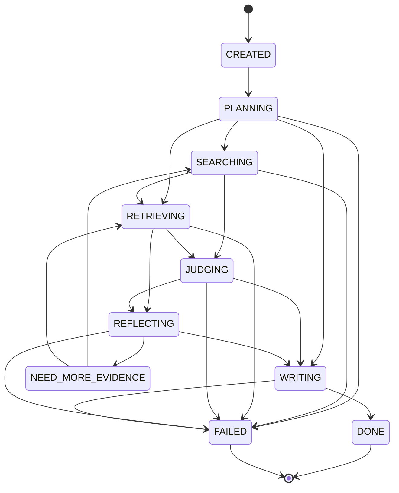

# Agent 工作流引擎架构

## 状态机设计

AgentWorkflowEngine 管理从任务创建到最终输出的完整生命周期：



## 核心组件

### AgentWorkflowEngine

通用工作流引擎，不绑定特定 Agent 类型。核心职责：

1. **任务管理**：通过 `agent_task` 表记录每个任务的生命周期
2. **步骤追踪**：每个执行步骤作为 `agent_step` 持久化，包含输入/输出/耗时/token 用量
3. **事件溯源**：所有状态变更作为 `agent_event` 异步记录，不阻塞主流程
4. **指标采集**：Micrometer Timer/Counter 记录每步延迟和任务整体延迟

### 关键方法

| 方法 | 说明 |
|---|---|
| `startTask()` | 创建任务记录，状态 CREATED → PLANNING |
| `startStep()` | 创建步骤记录，状态 RUNNING |
| `completeStep()` | 完成步骤，记录输出、耗时、token |
| `transitionStatus()` | 状态转换，验证合法性，emit 事件 |
| `completeTask()` / `failTask()` | 终态处理 |
| `emitEvent()` | 异步写入事件，失败不影响主流程 |

## 数据库设计

### agent_task
| 字段 | 说明 |
|---|---|
| task_id | 全局唯一任务 ID |
| type | REACT / DEEP_RESEARCH / CUSTOM |
| status | WorkflowState 枚举值 |
| user_input | 原始用户输入 |
| final_output | 最终输出（报告/回答） |

### agent_step
| 字段 | 说明 |
|---|---|
| step_id | 全局唯一步骤 ID |
| task_id | 关联任务 |
| agent_name | 执行 Agent 名称（planner, retriever, writer...） |
| thought / action / action_input / observation | ReAct 范式字段 |
| input_tokens / output_tokens / latency_ms | 成本与性能指标 |

### agent_event
| 字段 | 说明 |
|---|---|
| event_type | STATE_CHANGED / STEP_STARTED / STEP_COMPLETED / TASK_COMPLETED |
| payload_json | 事件详情 JSON |

## 使用示例

```java
// 创建工作流任务
AgentTaskRecord task = workflowEngine.startTask(
    tenantId, "DEEP_RESEARCH", "AI Agent 在企業服務的應用趨勢",
    "balanced", chatId, sessionId);

// 执行步骤
AgentStepRecord step = workflowEngine.startStep(
    task.getTaskId(), "ResearchPlanner", 1,
    Map.of("topic", request.getTopic()));

// ... 执行实际逻辑 ...

// 完成步骤
workflowEngine.completeStep(step.getStepId(), "COMPLETED",
    outputMap, observation,
    thought, action, actionInput,
    inputTokens, outputTokens, latencyMs, null);

// 状态流转
workflowEngine.transitionStatus(task.getTaskId(),
    WorkflowState.SEARCHING, WorkflowState.RETRIEVING);

// 完成任务
workflowEngine.completeTask(task.getTaskId(), WorkflowState.DONE, finalReport);
```

## API 端点

| 端点 | 说明 |
|---|---|
| `POST /ai/workflow/react/chat` | 同步 ReAct 工作流 |
| `POST /ai/workflow/react/chat/stream` | SSE 流式 ReAct 工作流 |
| `GET /ai/workflow/tasks/{taskId}` | 查询任务详情（含步骤） |
| `GET /ai/workflow/tasks/{taskId}/events` | 查询事件流 |
| `GET /ai/workflow/tasks` | 租户任务列表 |
