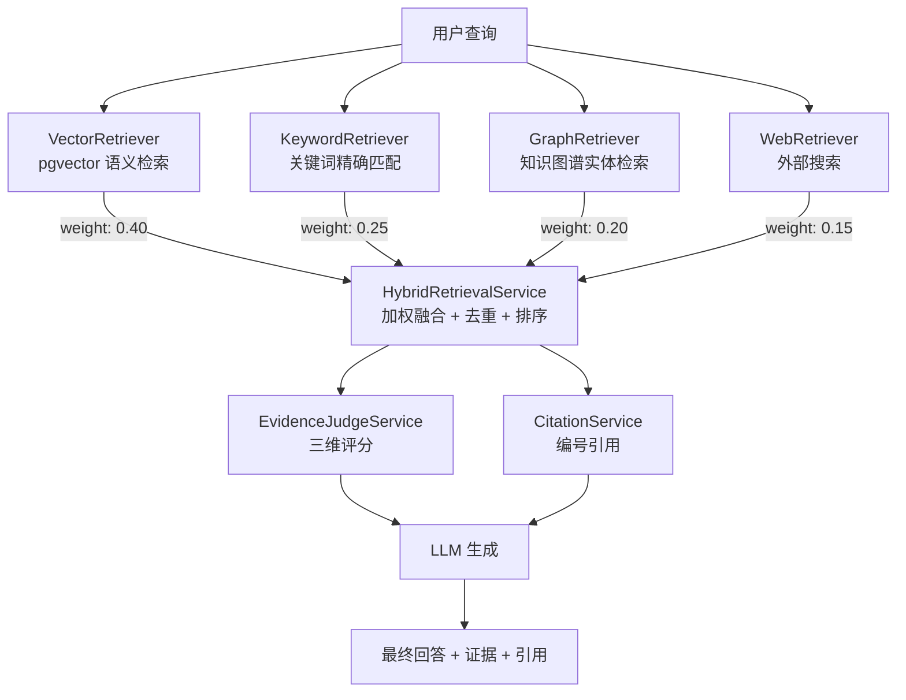

# 混合检索架构

## 四路召回融合



## 各检索器说明

### VectorRetriever（语义检索）
- 后端：pgvector + HNSW 索引
- 相似度阈值：0.45
- 过滤条件：`tenant_id + chat_id`
- 向量维度：1024（text-embedding-v4）

### KeywordRetriever（关键词检索）
- 标题关键词匹配（权重 0.6）+ 内容关键词重叠（权重 0.4）
- 对向量检索的补充：捕获精确术语匹配，如"Redis 缓存穿透"
- 使用 Jaccard 类重叠系数评分

### GraphRetriever（图谱检索）
- 实体名/别名搜索
- 一跳邻居关系召回
- 事实三元组（subject-predicate-object）搜索

### WebRetriever（外部搜索）
- 占位实现，DeepResearch 模块中接入真实搜索 API
- 权重最低（0.15），仅在有外部信息需求时启用

## 融合策略

1. **加权评分**：每个检索器结果乘以来源权重
2. **内容去重**：前 200 字符 fingerprint，保留最高分
3. **降序排序**：按 finalScore 排序取 topK

## 证据评分

EvidenceJudgeService 对每条证据做三维评分：

| 维度 | 权重 | 评分依据 |
|---|---|---|
| 相关性 (Relevance) | 0.50 | 检索分数 + query-doc 关键词命中 |
| 权威性 (Authority) | 0.30 | 来源类型（graph > vector > keyword > web） |
| 时效性 (Timeliness) | 0.20 | 元数据中的时间戳（<30天: 1.0, <365天: 0.7） |

综合评分：`score = relevance × 0.50 + authority × 0.30 + timeliness × 0.20`

## 引用溯源

CitationService 为每条证据生成编号引用：

```json
{
  "index": 1,
  "sourceType": "vector",
  "title": "enterprise-ai-report.pdf",
  "chunkId": "chunk-3",
  "confidence": 0.86,
  "excerpt": "根据 Gartner 2025 年报告，AI Agent 在企业服务领域的采用率..."
}
```

## API

| 端点 | 说明 |
|---|---|
| `POST /ai/rag/search` | 混合检索问答（返回 answer + evidence + citations） |

## 返回结构

```json
{
  "answer": "根據文檔分析，核心概念包括... [1][2]",
  "citations": [/* CitationItem[] */],
  "evidence": [{
    "sourceType": "vector|keyword|graph|web",
    "title": "...",
    "url": "...",
    "chunkId": "...",
    "score": 0.86,
    "relevanceScore": 0.92,
    "authorityScore": 0.75,
    "timelinessScore": 0.70,
    "reason": "向量语义匹配，相关度92%，权威度75%，时效度70%",
    "snippet": "..."
  }],
  "traceId": "trace-a1b2c3d4",
  "memoryUsed": []
}
```
