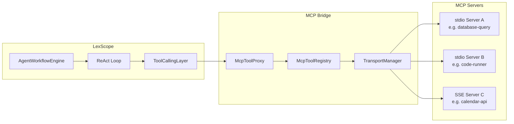
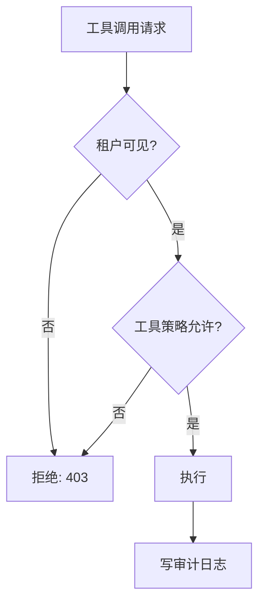

# MCP 工具桥接探索

## 概述

Model Context Protocol (MCP) 是 Anthropic 定义的开放协议，标准化了 LLM 与外部工具/数据源之间的交互层。LexScope Agent 当前的工具调用通过 Spring AI `@Tool` 注解硬编码在进程内。MCP 桥接的目标是：**将工具边界从进程内扩展到进程外，同时保持多租户隔离和审计能力不变**。

核心价值：

- **生态复用**：直接接入 MCP 生态中已有的工具服务器（数据库查询、代码执行、日历、CRM 等），无需逐个适配
- **安全隔离**：工具运行在独立进程中，崩溃或超时不影响主服务
- **租户可扩展**：不同租户可挂载不同 MCP 工具集，通过配置而非代码控制

## 架构

### 整体拓扑



### 核心组件

#### McpToolRegistry

维护租户可见的 MCP 工具清单。启动时或配置变更时通过 `tools/list` RPC 发现远程工具，将其注册为 Spring AI `ToolCallback` 对象。

| 字段 | 说明 |
|---|---|
| serverId | MCP 服务器唯一标识 |
| tenantId | 关联租户（空 = 全局） |
| transportType | `stdio` / `sse` |
| toolName | 远程工具名（如 `query_db`） |
| status | CONNECTED / DISCONNECTED / ERROR |

#### McpToolProxy

将 Spring AI 的 `ToolCallRequest` 序列化为 MCP `tools/call` 请求，转发给对应的 Transport。处理超时、错误格式化、token 计数透传。

#### TransportManager

管理 MCP 连接的生命周期：

- **stdio transport**：启动子进程，通过 stdin/stdout JSON-RPC 通信，适合本地工具
- **SSE transport**：HTTP 长连接，适合远程服务端工具
- 连接池 + 健康检查，断连自动重试

### 与现有引擎的集成点

```
ReAct Loop
  └─ ToolCallingLayer.invokeTool(toolName, args)
       ├─ 内置工具 → CourseTools / HybridRetrievalService（现有路径）
       └─ MCP 工具 → McpToolProxy.call(serverId, toolName, args)
                          → JSON-RPC → MCP Server → 返回结果
```

AgentWorkflowEngine 无需修改。MCP 工具在 `agent_step` 中表现为 `action_source = "mcp"` 以区分来源。

## 安全设计

### 租户权限



- 每个 MCP 服务器注册时绑定 `tenant_id` 列表
- `mcp_server_policy` 表控制：允许的工具名、最大调用频率、参数白名单
- 跨租户共享的服务器需显式标记 `tenant_id = NULL`（全局）

### 审计日志

所有 MCP 工具调用写入 `mcp_audit_log` 表：

| 字段 | 说明 |
|---|---|
| audit_id | 主键 |
| tenant_id | 调用租户 |
| server_id | 目标 MCP 服务器 |
| tool_name | 工具名 |
| input_hash | 参数 SHA-256（不存明文） |
| output_size | 返回大小（字节） |
| latency_ms | 耗时 |
| status | SUCCESS / TIMEOUT / ERROR |
| created_at | 时间戳 |

### 速率限制

- 全局：每 MCP 服务器 QPS 上限（默认 10/s），防止失控调用
- 租户级：每租户每 MCP 服务器 QPS 上限（默认 5/s）
- 工具级：危险工具（如 `execute_code`）独立限流（默认 1/min）
- 实现复用现有 `RateLimitFilter` 的令牌桶逻辑

### Secret 处理

- MCP 服务器凭证（API key、数据库密码）存储在 `mcp_server_config` 表，`value` 字段加密（AES-256-GCM）
- TransportManager 启动子进程时通过环境变量注入，不写入命令行参数
- 审计日志中参数只存 hash，输出截断到 4KB

## 风险与缓解

| 风险 | 影响 | 缓解措施 |
|---|---|---|
| MCP 服务器被攻破，返回恶意内容 | LLM 被注入攻击 | 返回内容走 `SanitizeService` 过滤；危险工具结果需人工审批 |
| 三方 MCP 服务器供应链风险 | 数据泄露或服务中断 | 仅允许白名单服务器；新服务器需安全审查 + 沙箱运行 |
| stdio 子进程资源泄漏 | 内存/CPU 耗尽 | 进程超时自动 kill（默认 30s）；cgroup 内存上限 |
| MCP 协议版本不兼容 | 工具调用失败 | TransportManager 启动时做版本协商；记录兼容矩阵 |
| 大量租户同时连接 | 连接池耗尽 | 连接池大小可配；优先级队列；非活跃连接自动回收 |

## POC 计划

### 第一阶段：stdio 传输桥（1-2 周）

**目标**：ReAct Agent 能调用一个本地 MCP stdio 工具端到端。

范围：

1. 实现 `McpToolRegistry` + `McpToolProxy`（轻量版，不带租户隔离）
2. 实现 `StdioTransport`：启动子进程、JSON-RPC 编解码、超时控制
3. 写一个示例 MCP 工具服务器（Python）：`read_file` / `list_directory`
4. 将示例工具注册为 Spring AI `ToolCallback`，在 ReAct Loop 中可调用
5. `agent_step` 记录 `action_source = "mcp"` + 审计日志

**验收标准**：ReAct Agent 能通过 MCP 调用 `read_file` 工具读取本地文件，结果正确返回，审计日志可查。

### 第二阶段：安全加固 + SSE（2-3 周）

- 租户级权限控制
- SSE transport 支持
- 速率限制集成
- 连接池和健康检查

### 第三阶段：生产化（3-4 周）

- Secret 加密存储
- 工具结果内容过滤
- 监控指标（Prometheus）
- 管理界面：租户管理员可配置可见 MCP 服务器

## 开放问题

1. **工具发现粒度**：MCP `tools/list` 返回所有工具，是否需要支持按租户过滤工具可见性？（vs. 服务器级过滤）
2. **结果缓存**：MCP 工具调用结果是否需要缓存？如果缓存，TTL 策略如何与租户数据隔离配合？
3. **流式工具**：MCP 规范中 `tools/call` 是 request-response 模型，不支持流式。对于长时间运行的工具（如代码执行），是否需要扩展为 SSE streaming？
4. **Spring AI 版本**：Spring AI 1.0 已内置 MCP Client 支持。POC 是否直接使用官方客户端，还是自建更轻量的实现？
5. **错误语义**：MCP 工具返回的错误如何映射到 ReAct Loop 的 `observation`？直接透传 vs. 标准化错误码？
6. **多语言工具服务器**：POC 示例用 Python 写 MCP 服务器。生产环境中 Java 工具是否需要 MCP 封装，还是继续用 `@Tool` 内置调用？
