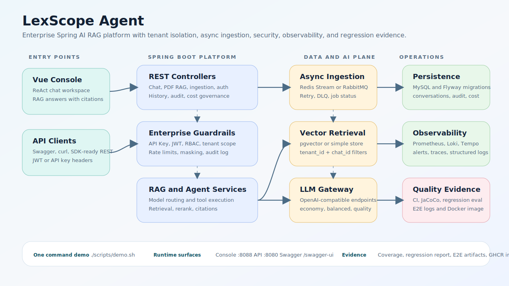

# LexScope Agent 文档

LexScope Agent 是一个面向民商事法律场景的案例分析与法规检索 Agent 平台。项目把 Spring AI RAG 后端、Vue 控制台、PDF 入库、向量检索、引用来源回答、JWT/API Key 安全、Docker 部署和可观测性整合成一个可运行的作品级系统。

## 从这里开始

| 目标 | 文档 |
|---|---|
| 了解项目 | [项目 README](../README.md) |
| 新开 Codex 窗口继续维护 | [Codex 交接指南](CODEX_HANDOFF.md) |
| 本地运行 | [快速开始](getting-started.md) |
| 体验演示流程 | [演示脚本](demo-script.md) |
| 手动调用接口 | [API 示例](api-recipes.md) |
| 理解架构 | [企业架构](architecture-enterprise.md) |
| 运行和维护服务 | [运维手册](operations.md) |

## 推荐首次测试

1. 准备 `.env.demo`，配置兼容 OpenAI 的对话模型和 embedding 模型。
2. 使用 Docker Compose 或 `scripts/start_windows.ps1` 启动服务。
3. 打开 `http://localhost:8088`。
4. 使用本地演示 API Key 获取访问身份。
5. 上传一份民商事法律 PDF。
6. 提问并检查回答是否包含参考来源或依据摘要。

## 运行入口

| 入口 | URL |
|---|---|
| 前端控制台 | `http://localhost:8088` |
| 后端 API | `http://localhost:8080` |
| Swagger UI | `http://localhost:8080/swagger-ui/index.html` |
| OpenAPI JSON | `http://localhost:8080/v3/api-docs` |
| 健康检查 | `http://localhost:8080/actuator/health` |
| RabbitMQ 控制台 | `http://localhost:15672` |

## 平台能力

| 模块 | 覆盖能力 |
|---|---|
| 法律 RAG | PDF 上传、异步入库、向量检索、带参考来源的回答 |
| Agent 工作流 | ReAct 风格问答、流式输出、会话和版本界面 |
| 安全 | API Key、JWT、刷新 token、租户隔离、审计日志 |
| 部署 | Docker Compose、Windows PowerShell 脚本、本地可复现运行 |
| 可观测性 | 健康检查、指标、日志、Tempo/Loki/Prometheus 配置 |

## 仓库

源码仓库：[ZephyrWn/lexscope-agent](https://github.com/ZephyrWn/lexscope-agent)
